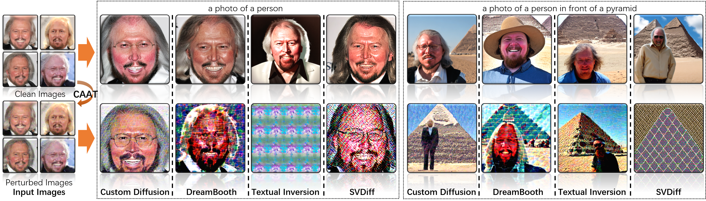

# Perturbing Attention Gives You More Bang for the Buck: Subtle Imaging Perturbations That Efficiently Fool Customized Diffusion Models
<a href="https://arxiv.org/abs/2404.15081"></a>
<div align="center">
    
</div>

> **Abstract**: Diffusion models (DMs) embark a new era of generative modeling and offer more opportunities for efficient generating high-quality and realistic data samples. However, their widespread use has also brought forth new challenges in model security, which motivates the creation of more effective adversarial attackers on DMs to understand its vulnerability. We propose CAAT, a simple but generic and efficient approach that does not require costly training to effectively fool latent diffusion models (LDMs). The approach is based on the observation that cross-attention layers exhibits higher sensitivity to gradient change, allowing for leveraging subtle perturbations on published images to significantly corrupt the generated images. We show that a subtle perturbation on an image can significantly impact the cross-attention layers, thus changing the mapping between text and image during the fine-tuning of customized diffusion models. Extensive experiments demonstrate that CAAT is compatible with diverse diffusion models and outperforms baseline attack methods in a more effective (more noise) and efficient (twice as fast as Anti-DreamBooth and Mist) manner.

## Setup
Our code relies on the [diffusers](https://github.com/huggingface/diffusers) library from Hugging Face 🤗.
Create envrionment:
```shell
cd CAAT
conda create -n CAAT python=3.8 
conda activate CAAT  
pip install -r requirements.txt  
```
## Pretrained Model
